<h1 data-importer="text" align="center">Olá Mundo 🌍</h1>

<picture>
  <source media="(prefers-color-scheme: dark)" srcset="https://raw.githubusercontent.com/gustavocoelhodasilva/gustavocoelhodasilva/output/snake-dark.svg">
  <source media="(prefers-color-scheme: light)" srcset="https://raw.githubusercontent.com/gustavocoelhodasilva/gustavocoelhodasilva/output/snake.svg">
  
</picture>

  
<h4><b>🔵 Saiba sobre mim</b>
</h4>
  
  <blockquote>
    <h3>👋 Olá! Seja bem-vindo ao meu perfil</h3>
    
Atualmente estou focado em aprender lógica de programação e Python. Fiz o Curso de Python até o mundo 3 no Curso em video do Gustavo Guanabara.

    
   📚 O que estou estudando:
    <ul>
      <li>🐍 <b>Python: </b>lógica de programação, sintaxe.</li>
      <li>🌐 <b>HTML:</b> Estruturação de páginas web.</li>
      <li>💻 <b>C:</b> Fundamentos de computação.</li>
    </ul>
  </blockquote>

 

  

  
  

---

---

<h4>Vitrine Profissional✨</h4>

     <ul>
          <li><a href="https://github.com/gustavocoelhodasilva/Cromo-RPG">⚔️Cromo-RPG.</a></li>
          <li><a href="https://github.com/gustavocoelhodasilva/Exercicios-em-Python">🐍Exercicios em Python do Curso em video.</a></li>
    </ul>
 

---

  
<h4>Estou aprendendo 🧠</h4>

              

          
          
          
          
          
        

  

---

  
<h4>Ferramentas 🧰</h4>

  
  
  

---

  

###

###

###

